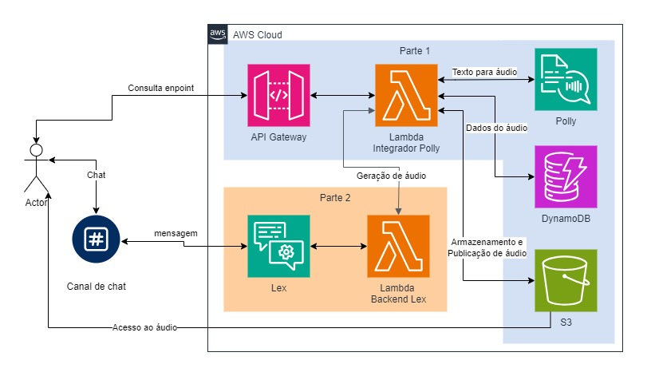

# FastCar Assist

Este projeto faz parte da Sprint 6~7 do Programa de Bolsas Compass UOL e AWS. O objetivo deste projeto é criar uma API que recebe frases do usuário e converte-as em arquivos de áudio MP3 utilizando o serviço Polly da AWS. Adicionalmente, foi desenvolvido um chatbot que interage com essa API para gerar respostas em áudio.

## Objetivo

O objetivo deste projeto é criar um chatbot interativo que responda às dúvidas dos usuários, oferecendo respostas tanto em texto quanto em áudio. A solução utiliza uma integração serverless com os serviços AWS Lex e Slack, permitindo uma experiência de atendimento automatizado eficiente e flexível.

## Dificuldades conhecidas
- A equipe teve dificuldades com a criação do Chatbot utilizando o serviço Lex da AWS
- A equipe também enfrentou dificuldades na integração da parte 2 com a parte 1 do projeto

## Tecnologias Utilizadas


## Estrutura de Pastas
```
api-tts/
├── dynamo_manager.py
├── polly_manager.py
├── s3_manager.py
├── tts_service.py
├── utils.py
├── .gitignore
├── handler.py
├── requirements.txt
├── serverless.yml
└── test.http
Chat-bot/
├── FastCarChatBot-DRAFT-WR1GVNMEUU-LexJson.zip
assets/
├── sprint6-7.jpg
README.md
```
## Sumário

1. [Organização da Equipe](#organizacao-da-equipe)
2. [Explicação do Projeto](#explicação-do-projeto)
3. [Serviços AWS Implementados](#serviços-aws-implementados)
4. [API](#api)
5. [Processo de Deploy](#processo-de-deploy)
6. [Criação do Código](#criação-do-código)
7. [Link Slack](#executando-o-projeto)
8. [Referências](#referencias)
9. [Colaboradores](#colaboradores)

## Organização da Equipe

A equipe utilizou a ferramenta `Trello` seguindo a metodologia ágil `SCRUM`. As tarefas foram distribuídas de forma dinâmica, com cada membro escolhendo a task que desejava executar e todos colaborando com os desenvolvimentos de algoritmos de IA. Após a conclusão, o código era versionado no GitHub com o uso de `Commits Semânticos` para garantir a organização e clareza.

## Explicação do Projeto

Este projeto tem como objetivo desenvolver uma API que receba uma frase inserida pelo usuário e a converta em um arquivo de áudio em formato MP3. A conversão será realizada através do AWS Polly, e o áudio gerado será armazenado em um bucket S3 público. Em seguida, um chatbot será desenvolvido utilizando o Amazon Lex, com o intuito de interagir com a API criada, respondendo aos usuários com áudio.

## Serviços AWS Implementados

| Serviço AWS | Descrição |
| :--------- | :---------------------------------- |
| `AWS Polly` | `AWS Polly` é um Serviço de conversão de texto para fala.|
| `AWS Lambda` |  `AWS Lambda` serve para a execução do código de conversão e armazenamento.|
| `AWS DynamoDB` |  `AWS DynamoDB` serve para armazenamento das referências de áudios gerados.|
| `AWS S3` |  `AWS S3` serve para o armazenamento dos arquivos de áudio gerados.|
| `Amazon Lex V2` |  `Amazon Lex V2` serve para criar e gerenciar o chatbot que interage com a API.|
| `Serverless Framework` |  `Serverless Framework` serve para gerenciar o deploy e infraestrutura como código.|

## API

| Método | Endpoint | Descrição |
| :----- | :------- | :-------- |
| `GET` | `/` | A função health serve como uma verificação de saúde da API.|
| `GET` | `/v1` | A função v1_description simplesmente exibe a versão atual da API.|
| `POST` | `/v1/tts` | O retorno será uma resposta com o link para o áudio gerado e as informações relacionadas.|

Exemplo de uso:

Requisição:
```json
{
  "phrase": "Converta esse texto para áudio."
}
```

Resposta:
```json
{
  "received_phrase": "Converta esse texto para áudio",
  "url_to_audio": "https://meu-bucket/audio-xyz.mp3",
  "created_audio": "2024-10-10 17:00:00",
  "unique_id": "123456"
}

```

## Processo de Deploy
<div align = "center">

</div>

### Criação do código

## Guia de Utilização
#### Configuração do Ambiente

- Clone o repositório e mude para a branch "grupo-8":
```
  git clone https://github.com/Compass-pb-aws-2024-JULHO-A/sprints-6-7-pb-aws-julho-a.git
  cd api-tts
```
- Instale o Serverless Framework:
  
```
npm install -g serverless
```

- Configure suas credenciais da AWS:
```
serverless config credentials --provider aws --key YOUR_AWS_ACCESS_KEY --secret YOUR_AWS_SECRET_KEY
```

- Realize o deploy da API na AWS: 
```
serverless deploy
```

- Após o deploy, você verá os endpoints gerados. Teste as rotas / e /v1 para confirmar que a API está funcionando conforme o esperado.

#### Teste da API
- Acesse as rotas criadas e faça uma requisição POST para a rota /v1/tts no seguinte formato:
```
{
  "phrase": "Converta esse texto para áudio."
}
```

#### Pré-requisitos para utilização do Projeto:
 - Serverless
 - Git
 - Conta AWS
 - Slack


#### Clonando Repo

```git
  git clone https://github.com/Compass-pb-aws-2024-JULHO-A/sprints-6-7-pb-aws-julho-a.git
  git checkout grupo-8
```

#### Executando o projeto

A API, desenvolvida em Python, conta com endpoints principais que incluem verificação da saúde do sistema, consulta da versão da API e sua principal funcionalidade: a conversão de texto em áudio. Além de gerar o áudio, a API retorna informações essenciais como o texto original, um identificador único (ID), a URL do áudio gerado, a data da requisição e a frase recebida.

A API está integrada a um bot no Slack, automatizando o atendimento de uma locadora de veículos. Por utilizar o Amazon Lex, um serviço da AWS, a integração com o Slack é altamente escalável, permitindo que o chatbot cresça junto com a empresa. Essa solução proporciona uma experiência conversacional fluida e acessível para colaboradores e clientes, utilizando inteligência artificial de forma prática para otimizar operações e melhorar a comunicação.

- [ChatBot com Slack](https://join.slack.com/t/grupo-8workspace/shared_invite/zt-2sh4ta00i-m9UFOOtt_csDF4gUmCglRg)


## Referências

- [Amazon Lex V2](https://docs.aws.amazon.com/lexv2/latest/dg/what-is.html)
- [Polly](https://docs.aws.amazon.com/polly/latest/dg/what-is.html)

## Colaboradores

<table align="center">
  <tr align="center">
    <td>
      <a href="https://github.com/Gustavo2022003">
        
        <p>Gustavo <br/>Gutierrez</p>
      </a>
    </td>
    <td>
      <a href="https://github.com/RubensLFerreira">
        
        <p>Rubens <br/>Lima</p>
      </a>
    </td>
      </td>
      <td>
      <a href="https://github.com/joaoferrariac">
        
        <p>João  <br/>Ferrari</p>
      </a>
    </td>
    <td>
      <a href="https://github.com/devrodrigocsoares">
        
        <p>Rodrigo <br/>Cadeira</p>
      </a>
  </tr>
